# IP Distribution Decision Verticals

**A cost variance, breakeven and A/B testing framework for deciding how to take intellectual property to market, organized by business type.**

[](https://shamarrobinson.github.io/ip-distribution-decision-verticals/)
[](https://public.tableau.com/app/profile/shamar.robinson/viz/IPDistributionDecisionVerticals/IPDistributionDecisionVerticals)
[](docs/IP_Distribution_Decision_Verticals.pdf)
[](workbook/IP_Distribution_Cost_Variance_Model.xlsx)

> **Data as of <!--ASOF-->October 11, 2026<!--/ASOF-->.** All prices, fees and rates reflect published terms on that date. The dataset is refreshed every three months; next refresh: <!--NEXT-->January 11, 2027<!--/NEXT-->. See [Quarterly refresh](#quarterly-refresh).

> **Status note:** certain works referenced by this analysis are in the initial stage of pre-publication copyright registration with the [U.S. Copyright Office](https://www.copyright.gov/registration/). No title-specific details are disclosed.

---

## Contents
1. [The decision](#the-decision)
2. [Key findings](#key-findings)
3. [Why this matters beyond publishing](#why-this-matters-beyond-publishing)
4. [Market context from mainstream sources](#market-context-from-mainstream-sources)
5. [The IP value chain](#the-ip-value-chain)
6. [Cost variance analysis](#cost-variance-analysis)
7. [Breakeven analysis](#breakeven-analysis)
8. [Scenario, sensitivity and cash timing](#scenario-sensitivity-and-cash-timing)
9. [A/B test design](#ab-test-design)
10. [Decision trees and choice options](#decision-trees-and-choice-options)
    - [Stakeholder decision paths](#stakeholder-decision-paths)
11. [Tableau story](#tableau-story)
12. [Repository structure and reproducibility](#repository-structure-and-reproducibility)
13. [Methodology and assumptions](#methodology-and-assumptions)
14. [Quarterly refresh](#quarterly-refresh)
15. [Sources](#sources)

## The decision

Every owner of intellectual property faces the same distribution question: **which channels turn a protected work into the most contribution margin, at acceptable risk and cash timing?** The answer differs by business type, so the analysis is organized into five decision verticals:

| Vertical | Business type | Typical need |
|---|---|---|
| **A** | Independent creator | One work, Amazon-led discovery, limited capital |
| **B** | Small press or imprint | Bookstore and library placement |
| **C** | Catalog or backlist owner | Many titles, steady volume |
| **D** | Brand, educator or corporate IP owner | Owns an audience; sells direct |
| **E** | Wide ebook strategist | Digital-first, multi-retailer reach |

Platforms compared: **Amazon KDP, IngramSpark, Barnes & Noble Press, Lulu, PublishDrive and Draft2Digital.**

## Key findings

1. **Channel share drives the cost variance.** On a $16.99 paperback, KDP returns $6.79 per unit and IngramSpark's bookstore route returns $3.33. About $2.55 of the $3.47 gap is the retailer discount, not printing or fees.
2. **Breakeven depends on contribution per sale.** KDP recovers Year-1 fixed costs at 158 unit pairs (one print plus one ebook); IngramSpark needs 272. Platform fees alone are recovered within 42 pairs on every route.
3. **A subscription only wins at scale.** PublishDrive's $13.99 monthly fee beats IngramSpark's per-sale fees above 16.6 units per format per month, and beats Draft2Digital for ebooks above 40.1 units per month.
4. **Cash lags earnings by two to three months.** In an illustrative hybrid stack, $948 of earned royalties is still uncollected at month 12.
5. **Test before you cut price.** A $16.99 to $14.99 price test must lift unit sales by more than 21.4% just to break even.

**Recommendation:** a two-channel launch (KDP plus one wide route chosen by vertical), print non-returnable at launch, and one 90-day A/B test per quarter before committing to exclusivity or a subscription.

## Why this matters beyond publishing

The same toolkit applies to any business that licenses or sells intellectual property, and to most businesses that sell through intermediaries.

| Concept | How it is used here | Where else you see it |
|---|---|---|
| Cost variance analysis | Net royalty vs a KDP baseline, split into channel, production and fee drivers | Manufacturing, SaaS, healthcare budgeting |
| Gross-to-net (GTN) | List price to net royalty waterfall | Pharma, CPG, music streaming |
| Contribution margin and breakeven | Units needed to recover launch costs | Retail, restaurants, hardware startups |
| Fixed vs variable cost crossover | Subscription vs per-sale fee models | Cloud pricing, payments, logistics |
| Sensitivity and scenario analysis | Tornado chart; bear, base and bull volumes | Corporate FP&A, infrastructure finance |
| A/B testing and breakeven lift | Price and channel-term experiments with sample sizes | E-commerce, product, marketing |
| Days sales outstanding (DSO) | 45 to 105 days from sale to cash | Every B2B business |
| Pool-based payouts | Kindle Unlimited per-page rate | Music streaming pro-rata pools, ad networks |
| Returns reserve and counterparty risk | Returnable wholesale terms; retailer non-payment | Retail, distribution, insurance |

## Market context from mainstream sources

| Metric | Value | Source |
|---|---|---|
| U.S. publisher revenue, 2025 | $33.4B (+2.5%) | [Association of American Publishers, StatShot Annual](https://publishers.org/news/aap-statshot-annual-report-publishing-revenues-totaled-33-4-billion-for-calendar-year-2025/) |
| ISBNs issued in the U.S., 2025 | 4.17M (3.53M self-published, +38.7%) | [Bowker via Publishers Weekly](https://www.publishersweekly.com/pw/print/20260323/99943-book-output-topped-4-million-in-2025.html) |
| Print units sold, 2025 | 762.4M (+0.3%) | [Circana BookScan via Publishers Weekly](https://www.publishersweekly.com/pw/by-topic/industry-news/bookselling/article/99417-print-book-sales-rose-slightly-in-2025.html) |
| Copyright registrations, FY2025 | 415,780 (169,098 literary) | [U.S. Copyright Office](https://copyright.gov/history/USCO-Annual-Report-Facts-at-a-Glance.pdf) |
| Average e-filed registration time | 3.4 months (5.3 with correspondence) | [U.S. Copyright Office](https://www.copyright.gov/registration/docs/processing-times-faqs.pdf) |
| Standard Application fee | $65 rising to $85 (mid-Nov 2026) | [Hypebot](https://www.hypebot.com/2-months-left-before-u-s-copyright-fees-jump-dramatically/) |

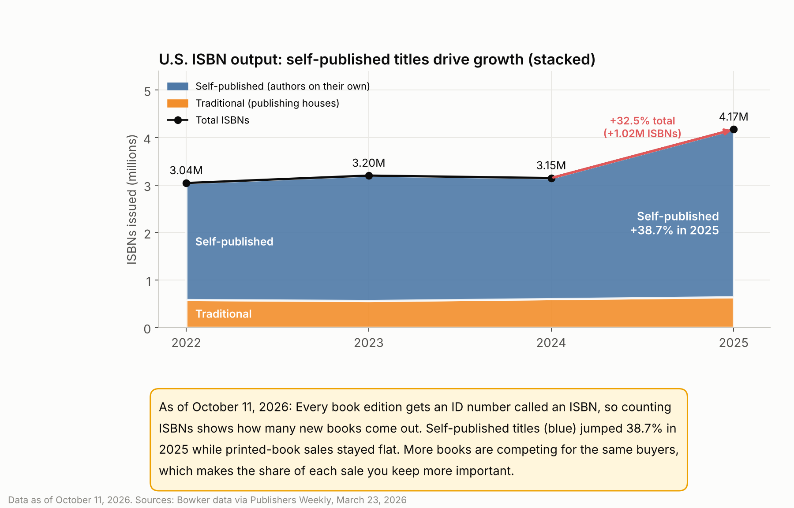
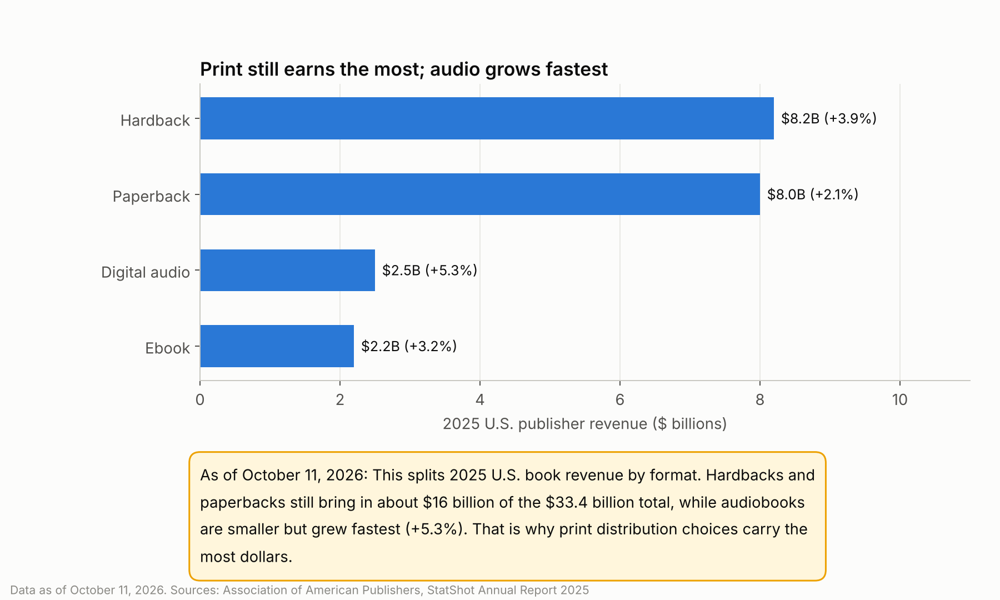

## The IP value chain

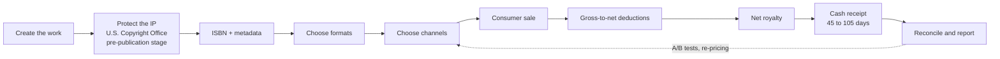
```mermaid
flowchart LR
  A[Create the work] --> B[Protect the IP<br/>U.S. Copyright Office<br/>pre-publication stage]
  B --> C[ISBN + metadata]
  C --> D[Choose formats]
  D --> E[Choose channels]
  E --> F[Consumer sale]
  F --> G[Gross-to-net deductions]
  G --> H[Net royalty]
  H --> I[Cash receipt<br/>45 to 105 days]
  I --> J[Reconcile and report]
  J -. A/B tests, re-pricing .-> E
```

## Cost variance analysis

Base case: $16.99 paperback, 200 pages. Variance is measured against the Amazon KDP baseline, and the three drivers sum exactly to the total.

| Platform | Channel share | Production | Platform fee | Net royalty | Variance vs KDP |
|---|---|---|---|---|---|
| Amazon KDP | $6.80 | $3.40 | $0.00 | **$6.79** | - |
| KDP Expanded Distribution | $10.19 | $3.40 | $0.00 | **$3.40** | $-3.40 |
| IngramSpark | $9.34 | $4.00 | $0.32 | **$3.33** | $-3.47 |
| B&N Press | $7.65 | $3.50 | $0.00 | **$5.84** | $-0.95 |
| Lulu Bookstore | $0.00 | $5.00 | $2.40 | **$9.59** | $2.80 |
| Lulu Retail | $8.49 | $5.00 | $0.70 | **$2.80** | $-4.00 |
| PublishDrive | $9.34 | $4.00 | $0.00 | **$3.65** | $-3.15 |

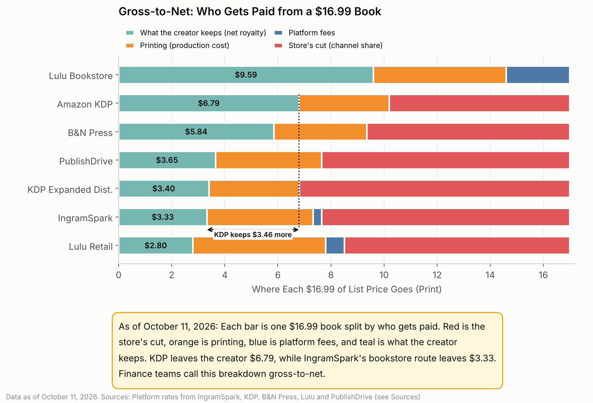
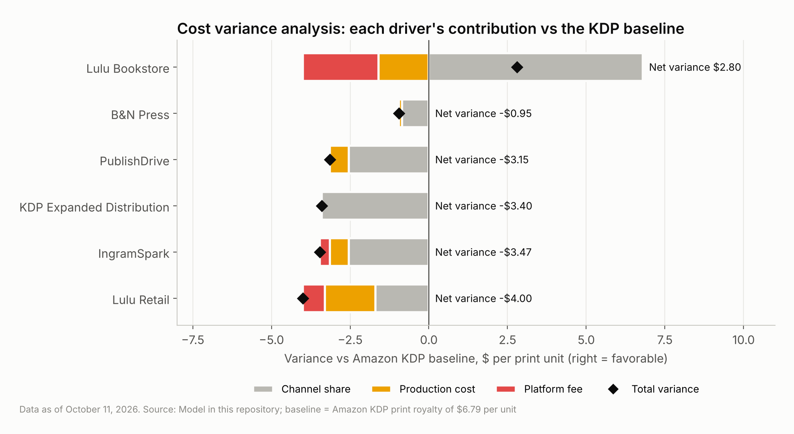
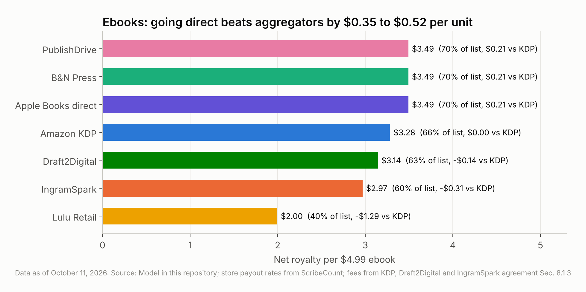

## Breakeven analysis

`Breakeven unit pairs = Year-1 fixed costs / contribution per unit pair`
Fixed costs = platform one-time fees + $85 copyright registration + $1,500 illustrative launch budget + subscriptions.

| Platform stack | Contribution per unit pair | Year-1 fixed costs | Breakeven unit pairs | Platform-only breakeven |
|---|---|---|---|---|
| Amazon KDP | $10.08 | $1,585 | 158 | 0 |
| IngramSpark | $6.30 | $1,710 | 272 | 20 |
| B&N Press | $9.34 | $1,710 | 184 | 14 |
| Lulu | $4.79 | $1,597 | 334 | 3 |
| PublishDrive | $7.14 | $1,878 | 264 | 42 |
| Draft2Digital (ebook only) | $3.14 | $1,605 | 511 | 7 |

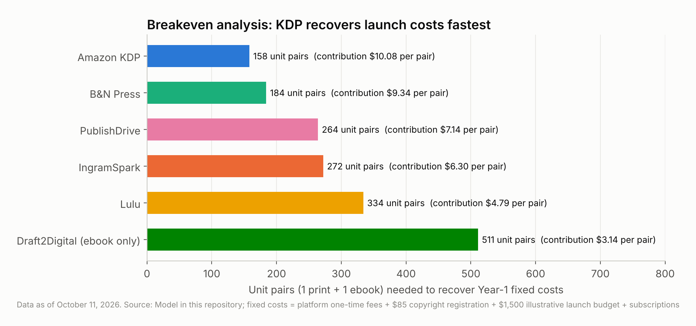
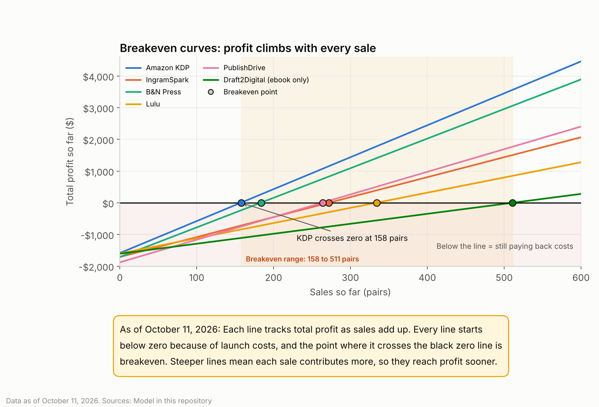
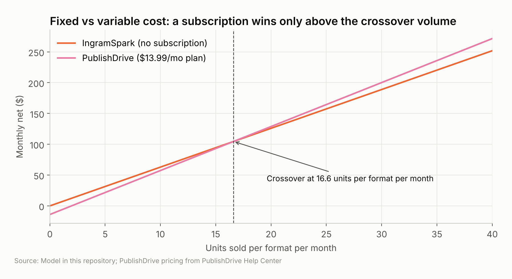

## Scenario, sensitivity and cash timing

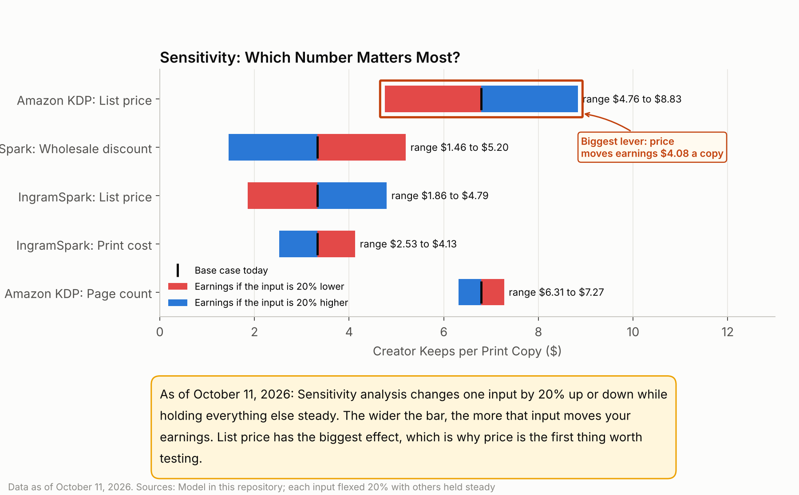
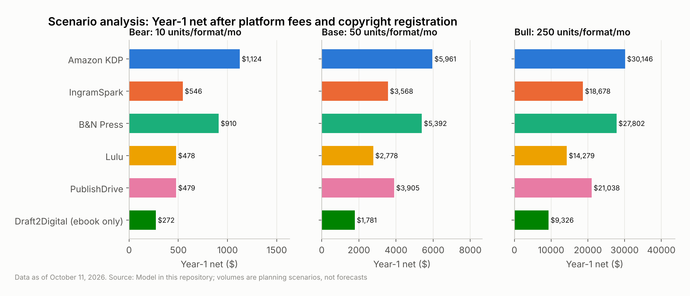
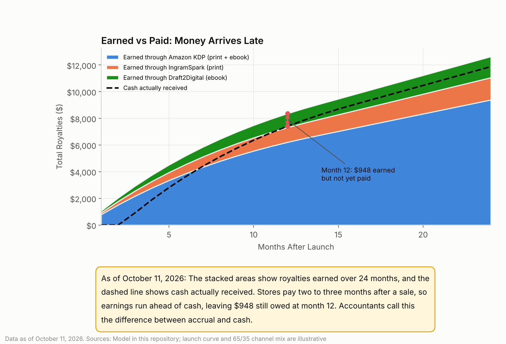
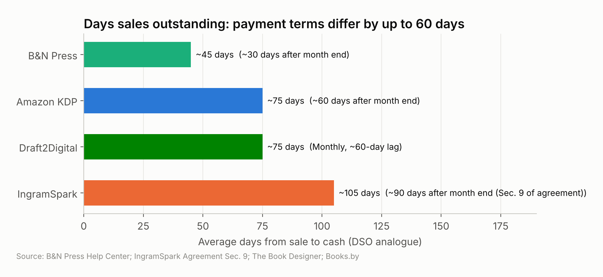
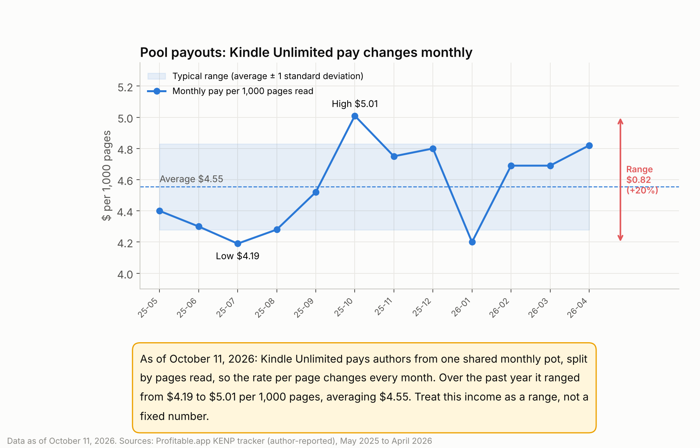

## A/B test design

| Test | Control vs challenger | Breakeven lift | Visitors per arm (80% power) |
|---|---|---|---|
| Print price | $16.99 vs $14.99 | 21.4% | ~18,467 at 2% conversion |
| Channel terms | 55% returnable vs 40% non-returnable | Control must outsell by 76.6% | Measured in monthly units |
| Ebook price | $4.99 vs $3.99 | 27.1% | ~7,814 at 3% conversion |

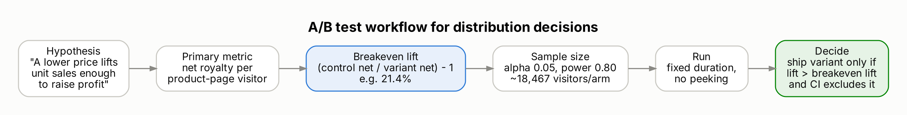
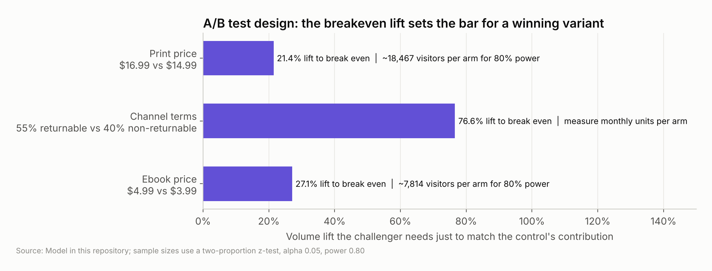

## Decision trees and choice options

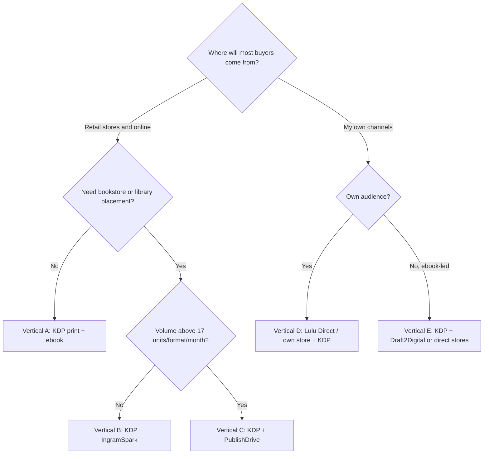
```mermaid
flowchart TD
  Q1{Where will most buyers come from?} -->|Retail stores and online| Q2{Need bookstore or library placement?}
  Q1 -->|My own channels| Q4{Own audience?}
  Q2 -->|No| A[Vertical A: KDP print + ebook]
  Q2 -->|Yes| Q3{Volume above 17 units/format/month?}
  Q3 -->|No| B[Vertical B: KDP + IngramSpark]
  Q3 -->|Yes| C[Vertical C: KDP + PublishDrive]
  Q4 -->|Yes| D[Vertical D: Lulu Direct / own store + KDP]
  Q4 -->|No, ebook-led| E[Vertical E: KDP + Draft2Digital or direct stores]
```

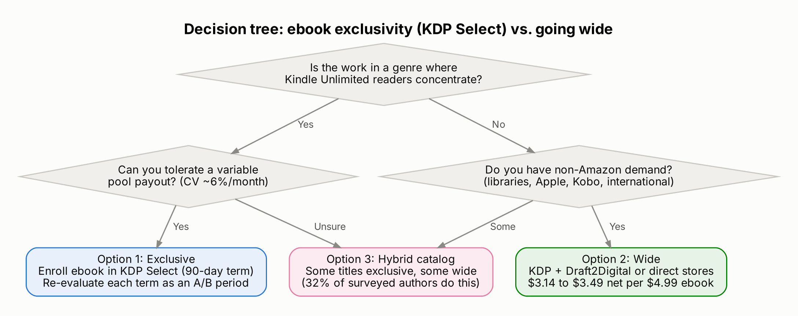
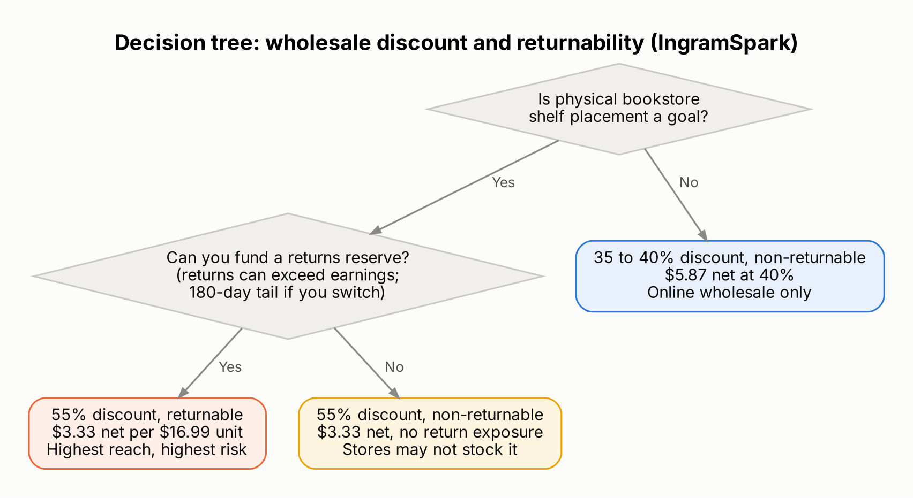

| Vertical | Option 1: Recommended | Option 2: Alternative (A/B arm) | Option 3: Stretch |
|---|---|---|---|
| A. Independent creator | KDP print + ebook | KDP + Draft2Digital | KDP + KDP Select |
| B. Small press or imprint | KDP + IngramSpark 55% returnable | KDP + IngramSpark 40% non-returnable | KDP + B&N Press + IngramSpark |
| C. Catalog or backlist owner | KDP + PublishDrive | KDP + IngramSpark + Draft2Digital | PublishDrive only |
| D. Brand, educator or corporate | Lulu Direct on own site + KDP | IngramSpark Share & Sell links | Lulu Bookstore + KDP |
| E. Wide ebook strategist | KDP + direct Apple, Kobo, B&N | KDP + Draft2Digital | KDP + PublishDrive (above 40/mo) |


### Stakeholder decision paths

Every chart in this repository carries a short "what is going on" note written in plain language, so readers from any industry can follow it. The deck ends with a walkthrough for each stakeholder type: the highlighted path through the decision tree, a summary, key numbers and what to do now, test next and watch.

| Stakeholder | Your path | Do now | Test next | Watch |
|---|---|---|---|---|
| **A. Independent creator** | 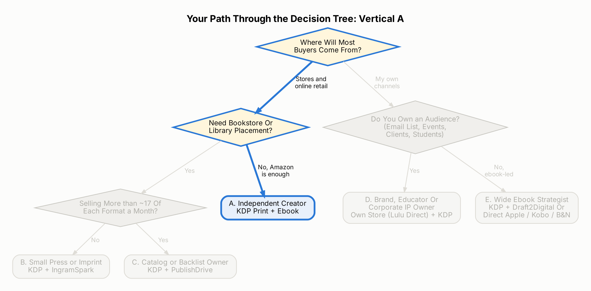 | KDP print + ebook; price ebooks $2.99 to $9.99; register the copyright before launch | $16.99 vs $14.99 for 90 days; keep the lower price only if sales rise more than 21% | Breakeven at 158 sales; then add a wide ebook route |
| **B. Small press or imprint** | 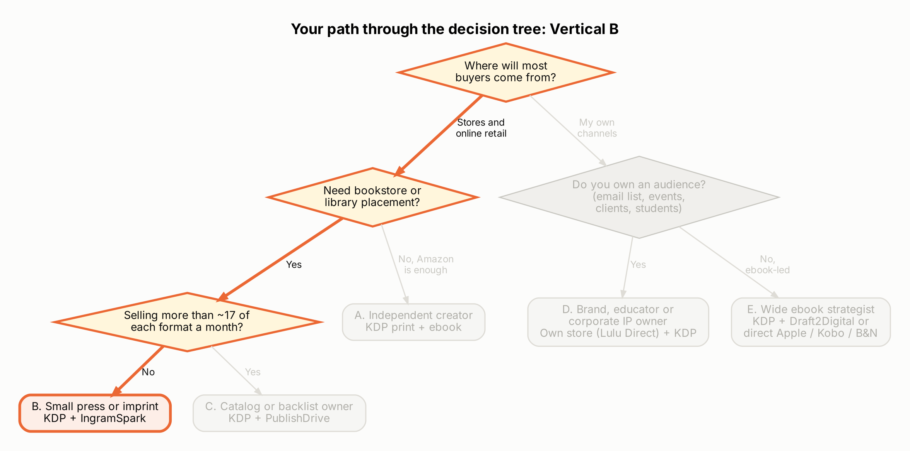 | KDP for Amazon + IngramSpark for bookstores; start non-returnable; hold a cash reserve for the 90-day lag | 55% returnable vs 40% non-returnable (returnable must sell 77% more) | Monthly returns and offsets; switch to Path C above ~17 sales/format/month |
| **C. Catalog or backlist owner** | 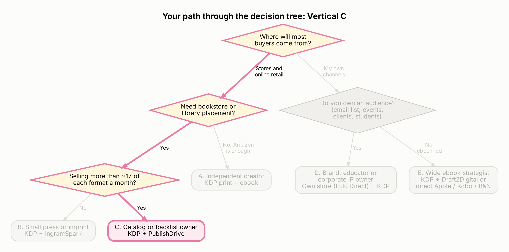 | KDP + PublishDrive plan sized to title count | Move half the catalog first and compare 90 days | Per-title volume vs the 16.6 switch point |
| **D. Brand, educator or corporate IP owner** | 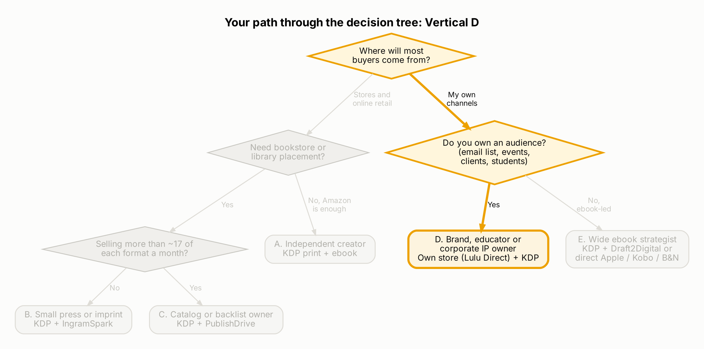 | Sell from your own site with Lulu Direct; keep KDP for discovery | Split one campaign between your store and Amazon; compare money kept per visitor | Fulfillment and support costs |
| **E. Wide ebook strategist** | 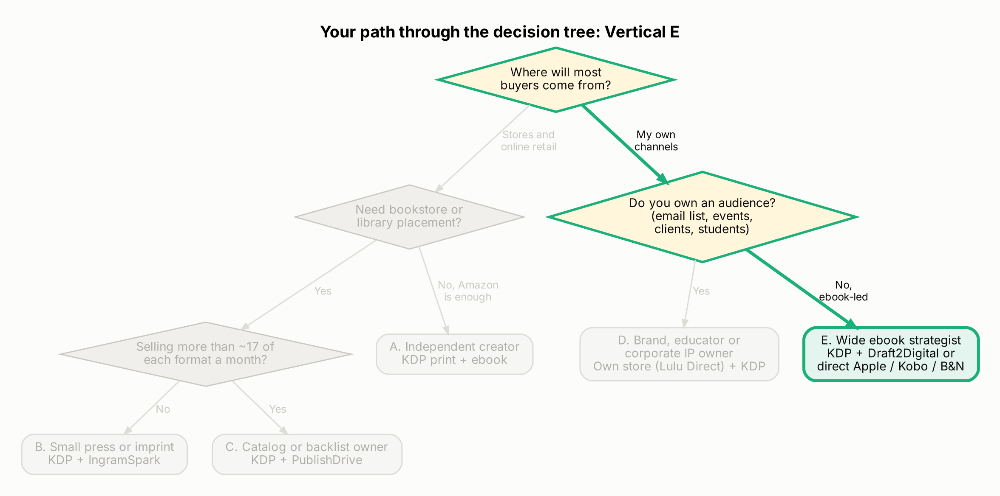 | KDP for Kindle + Draft2Digital or direct Apple, Kobo, B&N | One title in KDP Select for one 90-day term | Kindle Unlimited pay as a range; PublishDrive above 40 ebooks/month |

**What each team should do:** Finance and FP&A own the model and the monthly variance review; Marketing owns price tests and traffic; Rights and legal own copyright registration and contract terms; Investors ask for breakeven units, margin of safety, DSO and the scenario range; Operations turns on distribution only at launch and keeps metadata consistent.

## Tableau story

The Tableau workbook ([tableau/IP_Distribution_Decision_Verticals.twbx](tableau/IP_Distribution_Decision_Verticals.twbx)) contains a 10-point story with full-sentence captions. Each dashboard has a plain-language "what is going on" note and a numbered source list where each source name is a clickable link, and the last story point tells each stakeholder type what to do. Captions and annotations are listed in [tableau/story_captions.md](tableau/story_captions.md).

**[Open the Tableau story](https://public.tableau.com/app/profile/shamar.robinson/viz/IPDistributionDecisionVerticals/IPDistributionDecisionVerticals)**

## Repository structure and reproducibility

```
analysis/        model.py (all datasets), charts.py, diagrams.py, build_deck.py, build_tableau.py, stamp_workbook.py
data/            tidy CSVs used by the deck, Excel model and Tableau
charts/          SVG + PNG charts with plain-language notes; charts/pages has two-chart slide pages
diagrams/        Graphviz flowcharts and decision trees (.dot, .svg, .png)
docs/            GitHub Pages slide deck (index.html) and PDF export
tableau/         packaged Tableau workbook and story captions
workbook/        Excel cost variance model with live formulas
```

```bash
pip install matplotlib
pip install tableauhyperapi openpyxl
python analysis/model.py && python analysis/charts.py && python analysis/diagrams.py && python analysis/build_deck.py && python analysis/build_tableau.py && python analysis/stamp_workbook.py
```

## Methodology and assumptions

- One model writes every dataset, so the deck, Excel model and Tableau story agree.
- Base case: $16.99 paperback (200 pages), $4.99 ebook (2 MB), equal unit volume per platform.
- Print costs for IngramSpark ($4.00), B&N Press ($3.50) and Lulu ($5.00) are planning estimates to replace with each platform's calculator.
- The $1,500 launch budget, 65/35 channel mix and launch-decay curve are illustrative.
- A/B sample sizes use a two-proportion z-test (alpha 0.05, power 0.80).
- All prices, fees and rates are as of the date in `as_of.json`.
- Contract terms summarize the IngramSpark Agreement (last updated March 20, 2025) in plain language; this is not legal or financial advice.

## Quarterly refresh

Platform prices, fees and rates change often, so every figure is stamped with an **as of** date held in [`as_of.json`](as_of.json). Every three months a scheduled refresh:

1. Re-checks each source listed below for changed rates, fees and market figures.
2. Updates the assumptions in `analysis/model.py` and the date in `as_of.json`.
3. Re-runs `model.py`, `charts.py`, `build_deck.py`, `build_tableau.py` and `stamp_workbook.py`, then commits the result with a change log entry in [CHANGELOG.md](CHANGELOG.md).
4. Republishes the Tableau story over the same link.

## Sources

**Mainstream industry and government sources**
- [Association of American Publishers: StatShot Annual Report 2025](https://publishers.org/news/aap-statshot-annual-report-publishing-revenues-totaled-33-4-billion-for-calendar-year-2025/)
- [Bowker ISBN output via Publishers Weekly (March 2026)](https://www.publishersweekly.com/pw/print/20260323/99943-book-output-topped-4-million-in-2025.html)
- [Circana BookScan via Publishers Weekly](https://www.publishersweekly.com/pw/by-topic/industry-news/bookselling/article/99417-print-book-sales-rose-slightly-in-2025.html)
- [U.S. Copyright Office: FY2025 Facts at a Glance](https://copyright.gov/history/USCO-Annual-Report-Facts-at-a-Glance.pdf)
- [U.S. Copyright Office: registration processing times](https://www.copyright.gov/registration/docs/processing-times-faqs.pdf)
- [Hypebot: 2026 U.S. Copyright Office fee schedule](https://www.hypebot.com/2-months-left-before-u-s-copyright-fees-jump-dramatically/)

**Platform terms and rates**
- [IngramSpark Help Center: 2026 pricing changes](https://help.ingramspark.com/hc/en-us/articles/41657495062029-Changes-in-Print-Cost-Market-Access-Fee-and-More)
- [IngramSpark Agreement (Lightning Source)](https://www.ingramspark.com/)
- [Jane Friedman: IngramSpark 2026 pricing](https://janefriedman.com/ingramspark-will-increase-pricing-in-2026/)
- [Profitable.app KDP royalty calculator](https://profitable.app/tools/kdp-royalty-calculator)
- [BestWriting: KDP royalties explained](https://bestwriting.com/kdp-royalties)
- [B&N Press Help Center: Getting paid](https://help-press.barnesandnoble.com/hc/en-us/articles/5359658688923-Getting-Paid-for-Sales)
- [The Book Designer: B&N Press review](https://www.thebookdesigner.com/barnes-and-noble-press-review/)
- [Chapter: Lulu pricing](https://blog.chapter.pub/lulu-pricing/)
- [PublishDrive Help: pricing plans](https://help.publishdrive.com/how-much-publishdrives-distribution-pricing-plans)
- [PublishDrive vs Draft2Digital (April 2026)](https://publishdrive.com/comparison-guide-publishdrive-vs-draft2digital.html)
- [Books.by: Draft2Digital comparison](https://books.by/compare/booksby-vs-draft2digital)
- [ScribeCount: platform comparison](https://scribecount.com/tools/platform-comparison)
- [ScribeCount: How to publish on IngramSpark](https://scribecount.com/author-resource/publishing-a-book/How-to-Publish-on-IngramSpark)
- [Daniel Tortora: Self-publishing royalties 2026](https://danieljtortora.com/blog/self-publishing-royalties)

**Market behavior**
- [Written Word Media: 2025 Indie Author Survey](https://www.writtenwordmedia.com/2025-indie-author-survey-results/)
- [Profitable.app: KENP rate tracker](https://profitable.app/kdp/stats/kenp-rate)

---
Prepared by Shamar Robinson. Prices, fees and rates as of <!--ASOF2-->October 11, 2026<!--/ASOF2-->; refreshed quarterly.
